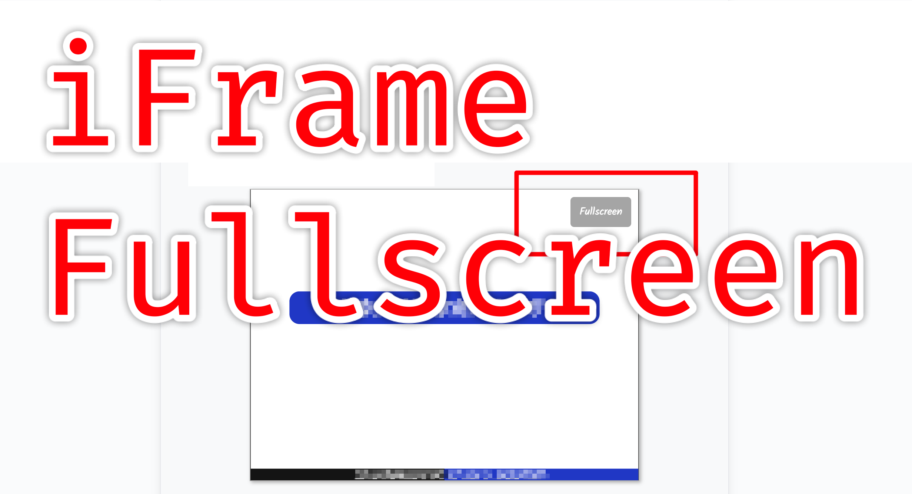

# Iframe Fullscreen Extension (for Chrome/Edge)

A simple yet powerful browser extension that adds a "Fullscreen" button to every iframe on a webpage, making it easy to view embedded content in full-screen mode.

## Features

- **Adds a Fullscreen Button**: Automatically detects all iframes on a page and overlays a clean, non-intrusive fullscreen button on the top-right corner.
- **Preserves Page Layout**: Intelligently wraps iframes without breaking the original page layout or dimensions.
- **Handles Dynamic Content**: Uses a `MutationObserver` to detect and handle iframes that are added to the page dynamically after the initial load.
- **Lightweight and Fast**: Minimal performance impact on your browsing experience.

## Installation

1.  Download or clone the extension files into a local folder (e.g., `iframe-fullscreen-extension`).
2.  Open your browser's extension page:
    -   **Chrome**: `chrome://extensions`
    -   **Edge**: `edge://extensions`
3.  Enable **Developer mode** (usually a toggle in the top-right corner).
4.  Click on the **"Load unpacked"** button.
5.  Select the `iframe-fullscreen-extension` folder.

The extension is now installed and active!

## How to Use

Simply navigate to any webpage that contains an `iframe`. You will see a "Fullscreen" button appear on the top-right of the embedded content. Click it to enter fullscreen mode.

---

## Disclaimer

**Note:** This entire browser extension, including all code (`.js`, `.css`, `.json`) and documentation (`.md`), was generated by Gemini, a large language model from Google.
